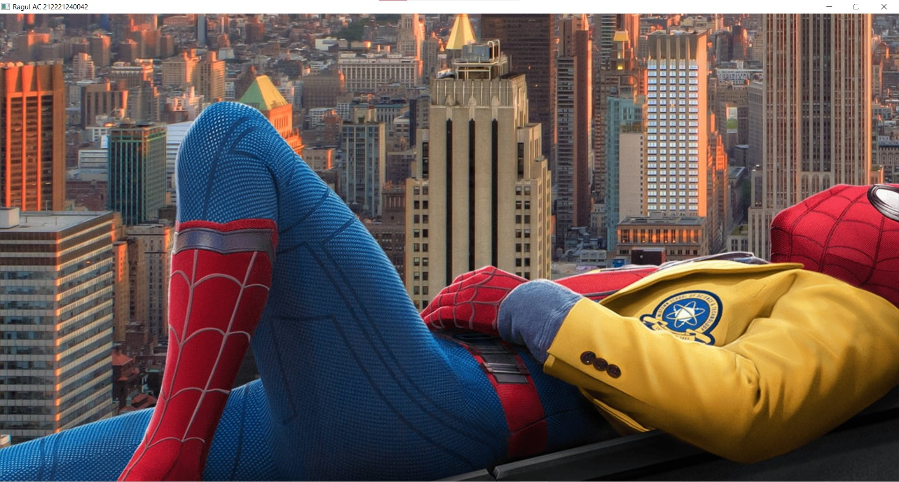
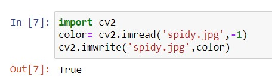
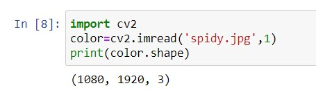
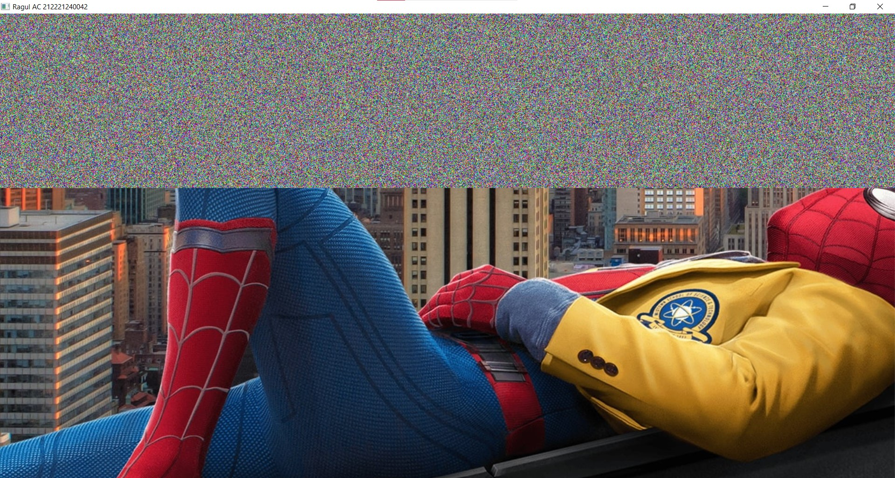
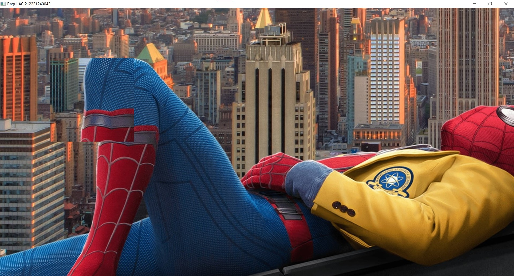

# Read and Write an Image:
## Aim:
#### To write a python program using OpenCV to do the following image manipulations.
##### i) Read, display, and write an image.
##### ii) Access the rows and columns in an image.
##### iii) Cut and paste a small portion of the image.

## Software Required:
Anaconda - Python 3.7
## Algorithm:
### Step 1:
Choose an image and save it as a filename.jpg
### Step 2:
Use imread(filename, flags) to read the file.
### Step 3:
Use imshow(window_name, image) to display the image.
### Step 4:
Use imwrite(filename, image) to write the image.
### Step 5:
End the program and close the output image windows.

## Program:
~~~
# Developed By: Ragul AC
# Register Number : 212221240042
~~~
## i) To Read and Display the image:
~~~
import cv2
color= cv2.imread('spidy.jpg',-1)
cv2.imshow('Ragul AC 212221240042',color)
cv2.waitKey(0)
~~~
## ii) To Write the image:
~~~
import cv2
color= cv2.imread('spidy.jpg',-1)
cv2.imwrite('spidy.jpg',color)
~~~
## iii) Find the Shape of the Image:
~~~
import cv2
color=cv2.imread('spidy.jpg',1)
print(color.shape)
~~~

## iv) To access Rows and Columns:
~~~
import cv2
import random
img= cv2.imread('spidy.jpg',-1)
for i in range(300):
    for j in range(img.shape[1]):
        img[i][j] = [random.randint(0,255),random.randint(0,255),random.randint(0,255)]
cv2.imshow('Ragul AC 212221240042',img)
cv2.waitKey(0)
~~~
## v) To Cut and Paste portion of image:
~~~
import cv2
img= cv2.imread('spidy.jpg',-1)
tag = img[200:450,200:450]
img[150:400,150:400] = tag
cv2.imshow('Ragul AC 212221240042',img)
cv2.waitKey(0)
~~~
## Output:
### i) Read and display the image:

### ii) Write the image:
 
### iii) Shape of the Image:

### iv) Access rows and columns:

### v) Cut and paste portion of image:

## Result:
Thus the images are read, displayed, and written successfully using the python program.